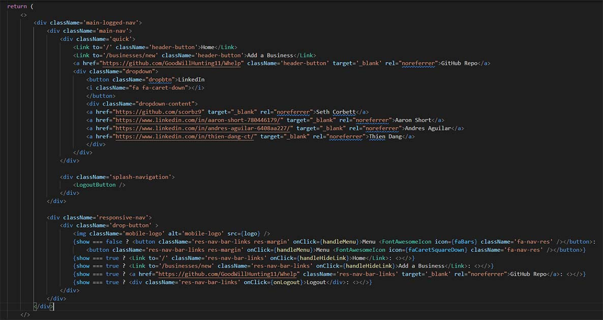
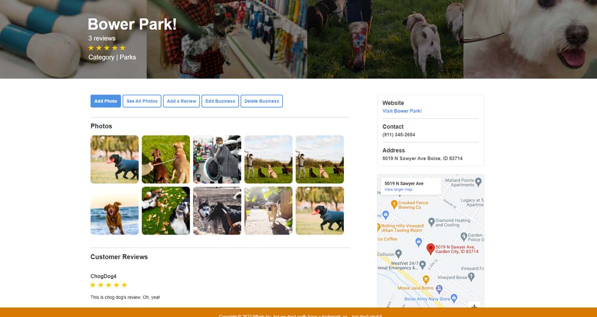
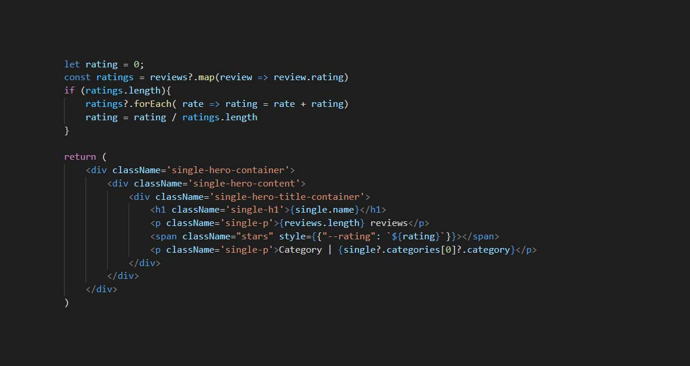
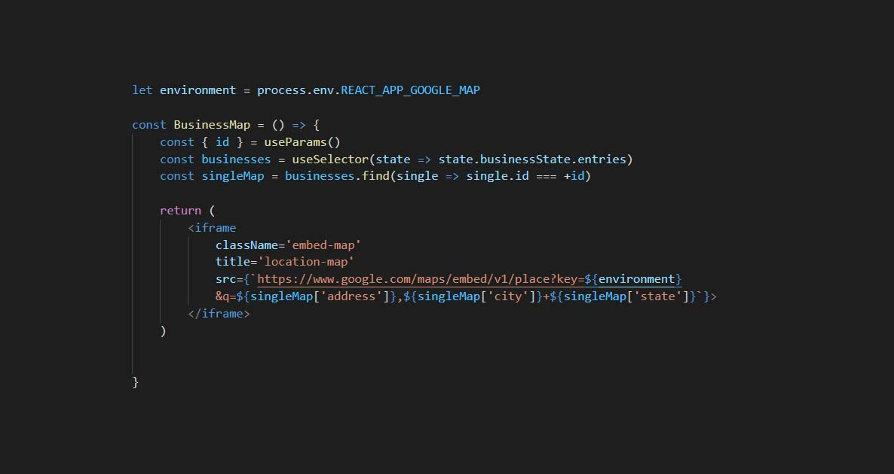
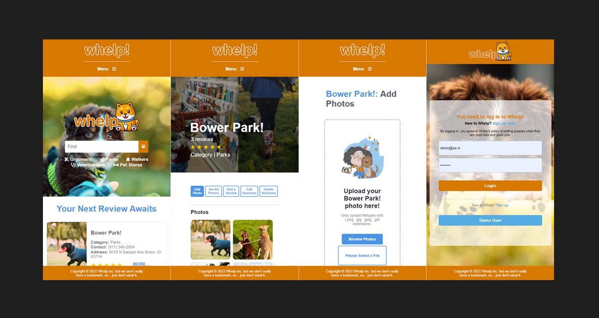

# Whelp
This is a clone of [Yelp](https://www.yelp.com/).

What rhymes with Yelp? Whelp! Whelp also happens to mean puppy, so take this puppy business review site for a walk in the park. Access the [Whelp MVP](https://whelp-aa.herokuapp.com/).

**Whelp** is the place to go to share your experiences with local canine businesses.

# Index
|
[MVP Feature List](https://github.com/GoodWillHunting11/Whelp/wiki/MVP-Feature-List) |
[Database Schema](https://github.com/GoodWillHunting11/Whelp/wiki/Database-Schema) |
[API Documentation](https://github.com/GoodWillHunting11/Whelp/wiki/API-Documentation) |
[Frontend Routes](https://github.com/GoodWillHunting11/Whelp/wiki/Frontend-Routes) |

# Technologies Used


# Clone Whelp

1. Clone this repository (only this branch)

   ```bash
   git clone https://github.com/GoodWillHunting11/Whelp.git
   ```
2. Install dependencies

      ```bash
      pipenv install --dev -r dev-requirements.txt && pipenv install -r requirements.txt
      ```

3. Create a **.env** file based on the example with proper settings for your
   development environment
4. Setup your PostgreSQL user, password and database and make sure it matches your **.env** file

5. Get into your pipenv, migrate your database, seed your database, and run your flask app

   ```bash
   pipenv shell
   ```

   ```bash
   flask db upgrade
   ```

   ```bash
   flask seed all
   ```

   ```bash
   flask run
   ```

6. To run the React App, cd into the `react-app` directory.

   ```bash
   npm install
   ```

   ```bash
   npm start
   ```

# Features Highlight
## Responsive Mobile Navigation
Whelp, what's the point of developing a social media site without making it accessible to users on their mobile devices? Whelp consists of multiple navigation components, each with their own responsive menus when a user's viewport drops below a certain pixel width. Once the mobile menu is enabled, the
primary menu is disabled and a button appears allowing users to either open or collapse the new mobile menu. The mobile menus eliminate developer links, as those
links should be seen in all their glory on the largest screens possible.



## Star Ratings
What's the point in having reviews if you can't display a quick one-two for users to see a business' ratings? While not technically challenging, seeing stars fill out in fractions is pretty cool! Because while you might like a 4.5 stars rated business, a 4.9 is even better!




# Challenges Highlight
## Google Maps
Originally designed to produce a map and marker using a database that housed longitude and latitude coordinates, the Whelp team initially used a package that consisted of legacy code. While the package functioned as it was intended to, the package threw console warnings and lacked intuitive features, such as allowing users to grab directions from their locations to the businesses'.

The Whelp team then moved to another package that was rich in features. While the new package offered more than the Whelp team required, the process of fetching coordinates with Google's Geocode API, writing the coordinates into the database, and having to do the process over again upon a listing update was more than it was worth. Although, the Whelp team did fully developed this feature!

While searching through Google's different APIs, the Whelp team discovered a lightweight solution that not only updated without having to write to a second database table upon an address update, but provided every feature that users were accustomed to with Google Maps. The Whelp team ultimately executed upon the Maps feature by using Google's Embed Map API, which is completely free to use and allows users to tap on the map for directions to their favorite destinations.

From around 50 lines of code compacted down to one iframe that concatenates relevant endpoint data to fetch a lightweight, feature rich, and reliable map.



## Responsive Design
In a world where mobile devices dominate internet usage (*no citation, but you should believe), responsive design is a must. However, with the vast array (hah!) of browser, monitor, tablet, and cellphone offerings, designing a great end product for different view ports is not only challenging, but it is also challenging for dev teams, as team members often experience different viewing experiences throughout the development phases. It is rumored that the Whelp development team is still optimizing Whelp's mobile viewing experience till this day.


# Flask React Project

This is the starter for the Flask React project.

## Getting started

1. Clone this repository (only this branch)

   ```bash
   git clone https://github.com/appacademy-starters/python-project-starter.git
   ```

2. Install dependencies

      ```bash
      pipenv install --dev -r dev-requirements.txt && pipenv install -r requirements.txt
      ```

3. Create a **.env** file based on the example with proper settings for your
   development environment
4. Setup your PostgreSQL user, password and database and make sure it matches your **.env** file

5. Get into your pipenv, migrate your database, seed your database, and run your flask app

   ```bash
   pipenv shell
   ```

   ```bash
   flask db upgrade
   ```

   ```bash
   flask seed all
   ```

   ```bash
   flask run
   ```

6. To run the React App in development, checkout the [README](./react-app/README.md) inside the `react-app` directory.

***
*IMPORTANT!*
   If you add any python dependencies to your pipfiles, you'll need to regenerate your requirements.txt before deployment.
   You can do this by running:

   ```bash
   pipenv lock -r > requirements.txt
   ```

*ALSO IMPORTANT!*
   psycopg2-binary MUST remain a dev dependency because you can't install it on apline-linux.
   There is a layer in the Dockerfile that will install psycopg2 (not binary) for us.
***

## Deploy to Heroku

1. Before you deploy, don't forget to run the following command in order to
ensure that your production environment has all of your up-to-date
dependencies. You only have to run this command when you have installed new
Python packages since your last deployment, but if you aren't sure, it won't
hurt to run it again.

   ```bash
   pipenv lock -r > requirements.txt
   ```

2. Create a new project on Heroku
3. Under Resources click "Find more add-ons" and add the add on called "Heroku Postgres"
4. Install the [Heroku CLI](https://devcenter.heroku.com/articles/heroku-command-line)
5. Run

   ```bash
   heroku login
   ```

6. Login to the heroku container registry

   ```bash
   heroku container:login
   ```

7. Update the `REACT_APP_BASE_URL` variable in the Dockerfile.
   This should be the full URL of your Heroku app: i.e. "https://flask-react-aa.herokuapp.com"
8. Push your docker container to heroku from the root directory of your project.
   (If you are using an M1 mac, follow [these steps below](#for-m1-mac-users) instead, then continue on to step 9.)
   This will build the Dockerfile and push the image to your heroku container registry.

   ```bash
   heroku container:push web -a {NAME_OF_HEROKU_APP}
   ```

9. Release your docker container to heroku

      ```bash
      heroku container:release web -a {NAME_OF_HEROKU_APP}
      ```

10. set up your database

      ```bash
      heroku run -a {NAME_OF_HEROKU_APP} flask db upgrade
      heroku run -a {NAME_OF_HEROKU_APP} flask seed all
      ```

11. Under Settings find "Config Vars" and add any additional/secret .env
variables.

12. profit

### For M1 Mac users

(Replaces **Step 8**)

1. Build image with linux platform for heroku servers. Replace
{NAME_OF_HEROKU_APP} with your own tag:

   ```bash=
   docker buildx build --platform linux/amd64 -t {NAME_OF_HEROKU_APP} .
   ```

2. Tag your app with the url for your apps registry. Make sure to use the name
of your Heroku app in the url and tag name:

   ```bash=2
   docker tag {NAME_OF_HEROKU_APP} registry.heroku.com/{NAME_OF_HEROKU_APP}/web
   ```

3. Use docker to push the image to the Heroku container registry:

   ```bash=3
   docker push registry.heroku.com/{NAME_OF_HEROKU_APP}/web
   ```
